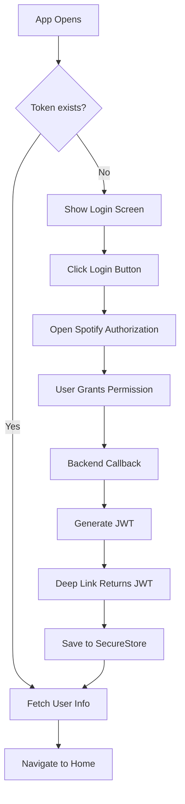

# 📱 Postify Mobile

> AI-powered Spotify playlist creator mobile application


## 🎯 Overview

Postify is a React Native mobile application that allows users to create personalized Spotify playlists using AI. Simply describe what kind of music you want, and AI will generate a curated playlist that you can instantly export to your Spotify account.

---

## ✨ Features

- 🔐 **Spotify OAuth Login** - Secure authentication with Spotify
- 🤖 **AI Playlist Generation** - Create playlists using natural language prompts
- 🎵 **Spotify Player Integration** - Preview songs directly in the app
- ⬆️ **Export to Spotify** - Save generated playlists to your Spotify account
- 💾 **Persistent Authentication** - Stay logged in with secure token storage
- 🎨 **Modern UI** - Spotify-inspired dark theme interface

---

## 🛠️ Tech Stack

| Technology | Purpose |
|-----------|---------|
| React Native + Expo | Cross-platform mobile framework |
| NativeWind | TailwindCSS for React Native |
| Expo Router | File-based navigation |
| Context API | State management |
| Expo SecureStore | Encrypted token storage |
| React Native WebView | Spotify player integration |
| Expo WebBrowser | OAuth flow |

---


## 🚀 Getting Started

### Prerequisites

- Node.js 18 or higher
- npm or yarn
- Expo CLI (`npm install -g expo-cli`)
- iOS Simulator (macOS) or Android Emulator
- Backend API running (see [Backend README](../backend/README.md))


## 📱 App Flow

### Authentication Flow


### Playlist Generation Flow
```
1. User enters prompt (e.g., "90s rock songs")
2. Click "Generate Playlist"
3. API call: GET /api/playlist/suggest?prompt=...
4. Backend calls OpenAI GPT-4o-mini
5. Backend fetches Spotify track details
6. Display songs with album covers
7. User clicks song → Modal with Spotify player
8. Click "Export to Spotify"
9. API call: POST /api/playlist/export
10. Playlist created in user's Spotify account
11. Success message
```

---

## 🎨 Screenshots
### Authentication & Home

<p align="center">
  
  
  
</p>

<p align="center">
  <i>Spotify login • AI prompt input • Generated playlist</i>
</p>


---

## 🔐 Security Features

- **Encrypted Token Storage**: JWT stored using Expo SecureStore (hardware-backed encryption on supported devices)
- **OAuth 2.0**: Industry-standard Spotify authentication
- **No Credentials Stored**: User passwords never touch the app
- **HTTPS Only**: All API requests use secure connections (production)
- **Token Expiration**: Automatic logout on invalid tokens


- [Backend API Documentation](../backend/README.md)
- [Spotify Web API](https://developer.spotify.com/documentation/web-api)
- [Expo Documentation](https://docs.expo.dev/)
